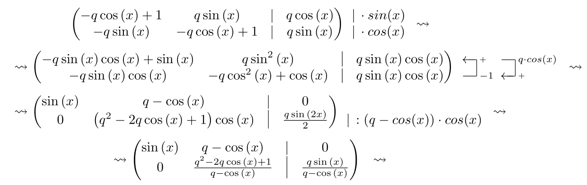

Небольшой (~200LoC) скрипт, который считает элементарные преобразования за вас, а также генерирует красивый TeX. Для работы скрипта необходимо поставить python-пакет `sympy` для символьных вычислений (как WolframAlpha, только для питона). В ту же директорию (папку), где находится ваш `.tex`-файл, необходимо поместить файл [gauss.sty](http://mirrors.ctan.org/macros/latex/contrib/gauss/gauss.sty), а в начало `.tex`-файла добавить строку `\usepackage{gauss}`.

Например, следующий код:
```python
import sympy
from sympy import sin, cos, Symbol

x = Symbol('x')
q = Symbol('q')

A = GaussMatrix([
    [1 - q * cos(x), q * sin(x), q * cos(x)],
    [-q * sin(x), 1 - q * cos(x), q * sin(x)],
], n_of_free=1)
A = mods_print(A,
    ROWS,
    eps3, (0, sin(x)),
    gmap, (0, sympy.expand),
    eps3, (1, cos(x)),
    gmap, (1, sympy.expand),
    PRINT,
    eps1, (0, 1, -1),
    gmap, (0, sympy.simplify),
    eps1, (1, 0, q * cos(x)),
    gmap, (1, sympy.simplify),
    PRINT,
    eps3, (1, (q - cos(x)) * cos(x)), {"div": True},
    gmap, (1, sympy.simplify),
)
```
Генерирует следующий тех:


### Дисклеймер
Код-стайл скрипта, так скажем, своебразный, но скрипт рабочий. Pull request'ы и Issues'ы приветствуются.

## Руководство по использованию

Все преобразования задаются как аргументы функции `mods_print`. Первый аргумент `mods_print` - сама матрица, все следующие - это либо тип преобразования, либо аргументы преобразования, либо специальные директивы.

Типы преобразования:
- `eps1`
  Принимает аргументы следующим параметром функции `mods_print` как кортеж `(i, j, x)` - прибавить строку / столбец `j` к строке / столбцу `i` с коэффициентом `x`.
- `eps2`
  Принимает аргументы следующим параметром функции `mods_print` как кортеж `(i, j)` - поменять местами строки / столбцы `i` и `j`.
- `eps3`
  Принимает аргументы следующим параметром функции `mods_print` как кортеж `(i, x)` - умножить строку / столбец `i` на `x`. После кортежа так же можно передать словарь, например такой: `{"div": True, "to_int": True}` - если `"div"` это `True`, то `eps3` разделит, а не умножит, что отразится в значке на стрелке преобразования. Если `"to_int"` это `True`, то после применения преобразования `eps3` также округлит.
- `gmap`
  Принимает аргументы следующим параметром функции `mods_print` как кортеж `(i, f)` - применить к строке / столбцу `i` функцию `f`.

Специальные директивы: `PRINT` - напечатать текующую матрицу, `NEW_LINE` - перенести строку, `ROWS` / `COLUMNS` - интерпретировать все следующие преборазования как преобразования над строками / столбцами.

Матрица должна иметь тип `GaussMatrix`. Первый параметр инициализации `GaussMatrix` - двумерный массив элементов, второй (опциональный) параметр `n_of_free` - сколько столбцов справа отделены чертой.

### Рекомендации по использованию
Просто скопируйте скрипт к себе на компьютер и добишите в конец нужные преобразования. Пример есть в конце скрипта.

### Альтернативы
@SergejVolkov сделал похожую штуку, у него поддерживается несколько алгоритмов, она с графическим интерфейсом и для винды, но там больше и сложнее код и он на C#, стрелки с преобразованиями она не показывает и текстового задания шагов, как у меня, на сколько я знаю нет: https://github.com/SergejVolkov/MatrixElementary.
